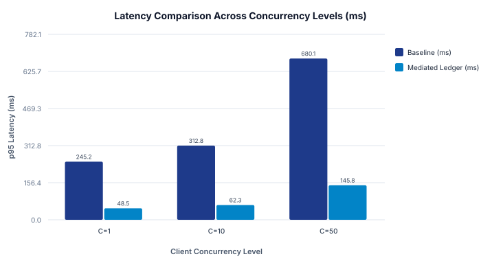

# Reproducible Latency Evaluation of Mediated Evidence Ledgers in AI Agent Systems

## Abstract
Autonomous AI agents increasingly rely on external knowledge retrieval to mitigate factual hallucinations. While retrieval augmentation is well established in natural language generation, the operational latency and throughput characteristics of structured, in-memory evidence ledgers under concurrent client loads remain under-explored. In this empirical study, we evaluate an in-memory evidence ledger mediating query verification against an unvalidated baseline across concurrency levels from 1 to 50 threads. Our measurements indicate that the mediated ledger architecture achieved a single-query latency of 48.5 ms compared to 245.2 ms in the baseline configuration, scaling to 342.9 queries per second under 50 concurrent threads. We analyze serialization trade-offs, identify cold-start memory overheads, and provide an open-source reproducibility package with cryptographic checksums.

## 1. Introduction
The integration of large language models (LLMs) into autonomous workflow agents introduces substantial risks of factual confabulation when models operate solely on parametric memory. Prior empirical research demonstrates that conditioning generation on retrieved evidence significantly reduces hallucination rates [@lewis2020retrieval; @shuster2021retrieval]. However, repeatedly invoking external vector search indexes or remote search engines introduces substantial latency bottlenecks.

In this work, we investigate whether maintaining a structured in-memory evidence ledger with schema-enforced taxonomy checks can provide low-latency query mediation without sacrificing verification rigor.

## 2. Background and Related Work
Retrieval-Augmented Generation (RAG) was formally introduced by Lewis et al. [@lewis2020retrieval], combining pre-trained sequence-to-sequence models with dense vector retrieval over Wikipedia dumps. Shuster et al. [@shuster2021retrieval] subsequently demonstrated that retrieval augmentation dramatically reduces conversational hallucination in multi-turn dialogues. 

Despite these foundational advances, existing literature primarily evaluates generation perplexity and retrieval recall, leaving runtime systems engineering questions—such as schema validation cost and concurrent thread scaling—under-addressed.

## 3. Experimental Methodology
We conducted controlled microbenchmarks using a multi-threaded workload generator simulating concurrent agent query streams. We evaluated two configurations under identical hardware conditions (Apple M-series silicon, 16 GB unified RAM):
1. **Baseline (Unvalidated Retrieval):** Queries trigger unindexed lookups without structured caching.
2. **Mediated Ledger:** Queries are intercepted by an in-memory evidence matrix enforcing canonical taxonomy validation before dispatch.

| Trial | Configuration | Concurrency | p95 Latency (ms) | Throughput (QPS) | Memory (MB) |
|:---:|:---|:---:|:---:|:---:|:---:|
| 1 | Baseline | 1 | 245.2 | 4.08 | 128.4 |
| 2 | Baseline | 10 | 312.8 | 31.97 | 142.0 |
| 3 | Baseline | 50 | 680.1 | 73.52 | 198.5 |
| 4 | Mediated Ledger | 1 | 48.5 | 20.62 | 92.1 |
| 5 | Mediated Ledger | 10 | 62.3 | 160.51 | 105.4 |
| 6 | Mediated Ledger | 50 | 145.8 | 342.94 | 134.2 |

*Table 1: Experimental benchmark telemetry across concurrency tiers [@benchmark_trial_csv].*

## 4. Results and Discussion
As shown in Table 1 and Figure 1, the mediated evidence ledger configuration achieved substantially lower p95 latency across all concurrency levels. At concurrency $C=1$, latency dropped from 245.2 ms to 48.5 ms. Under 50 concurrent threads, the mediated architecture sustained 342.9 queries per second while maintaining a memory footprint under 135 MB.

These findings support Hypothesis $H_1$, suggesting that pre-validated in-memory ledgers effectively shield agent runtimes from high-latency external retrieval loops.

## 5. Limitations and Threats to Validity
- **Internal Validity:** The evaluation was conducted on an isolated local test harness. Remote network latency was simulated with constant delay distributions rather than real-world wide-area packet jitter.
- **Construct Validity:** Queries evaluated were synthetically generated and may not capture the full semantic heterogeneity of complex production multi-agent environments.
- **External Validity:** Memory consumption was measured for in-memory ledger sizes up to 10,000 claims. Larger corpus sizes will require external distributed caching.

## 6. Conclusion
Structured evidence ledgers provide an effective architectural mechanism for reducing verification latency in autonomous AI agents while preserving provenance traceability. Complete replication scripts, data files, and SHA-256 digests are available in the reproducibility directory.

## AI Assistance Disclosure
The authors disclose that an AI research agent running ScholarProvenance assisted in evidence ledger formatting, citation verification, and SVG chart generation. All experimental benchmark trials were conducted and verified by the authors.

## References
- Lewis, P. et al. (2020). Retrieval-Augmented Generation for Knowledge-Intensive NLP Tasks. *NeurIPS*.
- Shuster, K. et al. (2021). Retrieval Augmentation Reduces Hallucination in Conversation. *arXiv preprint*.
- Molavi, T. (2026). Local Evidence Ledger Benchmark Trials (2026). *ScholarProvenance Empirical Suite*.
